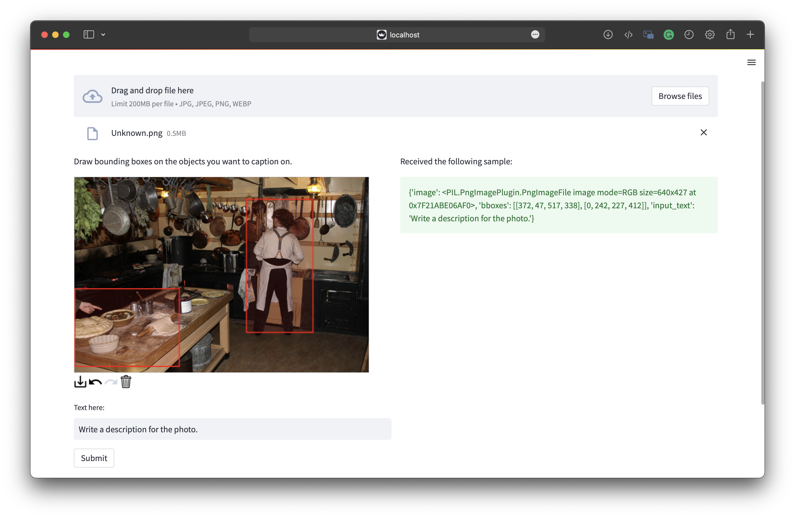

# GUI Demo for Image BBox Annotation

- A GUI demo for image bbox annotation.
- The GUI is implemented using [streamlit](https://www.streamlit.io/) and [streamlit_drawable_canvas](https://pypi.org/project/streamlit-drawable-canvas/).

## Features

- Receive image and bounding boxes annotations and text input from user.




## Dependencies

```
pip install streamlit streamlit_drawable_canvas
```

## Usage

```
streamlit run app.py --server.fileWatcherType none
```