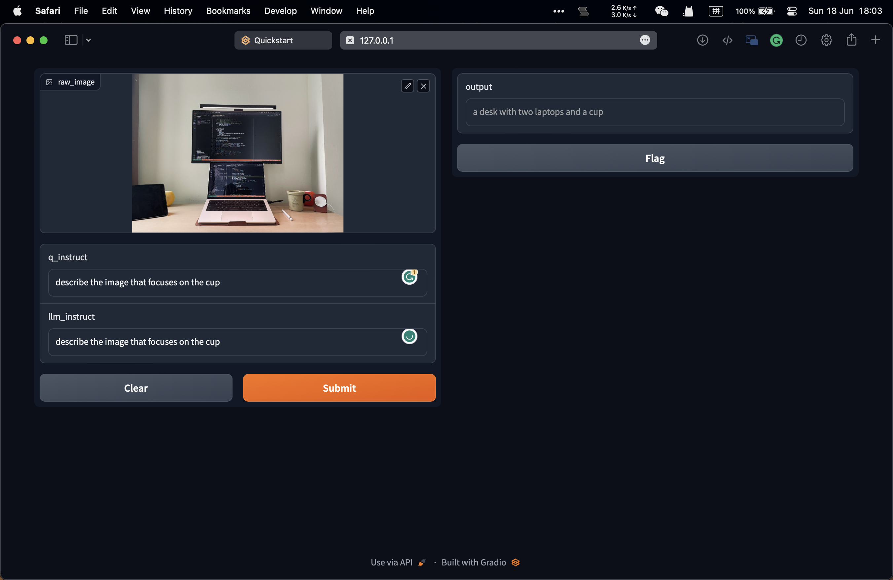

# GUI Demo Template for Image Text Input

- A GUI demo **template** for image text Input.
- The GUI is implemented using [gradio](https://gradio.app)

## Features

- Receive image and text input from user.




## Dependencies

```
pip install gradio
```

## Usage

```
python app.py --cfg-path path/to/config  --gpu-id 0
```