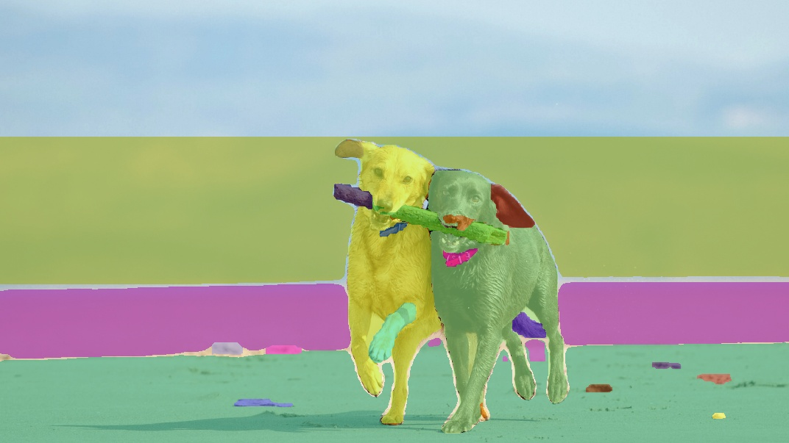

# FastSAM

## Prepare checkpoint

- Download `default`(`FastSAM`) checkpoint(`FastSAM-x.pt`, YOLOv8x based Segment Anything Model) from [Google Drive](https://drive.google.com/file/d/1m1sjY4ihXBU1fZXdQ-Xdj-mDltW-2Rqv/view?usp=sharing) into `./weights` folder.
- Try this command if it's not expired: 
    ```bash
    cd FastSAM
    mkdir weights
    wget -O  "FastSAM-x.pt" https://tmp-titan.vx-cdn.com/file-64b0b48467a52-64b0b490986ba/FastSAM-x.pt
    ```

## Inference


```
# Everything mode
cd FastSAM
conda activate FastSAM
python Inference.py --model_path ./weights/FastSAM-x.pt --img_path ./images/dogs.jpg
# image 1/1 /data/root/Documents/DEMOS/FastSAM/images/dogs.jpg: 576x1024 21 objects, 72.0ms
# Speed: 8.8ms preprocess, 72.0ms inference, 3.3ms postprocess per image at shape (1, 3, 1024, 1024)

# The output image is saved to `./output` folder
```

<!-- plot two image on one row -->
<div align="center">
  
  