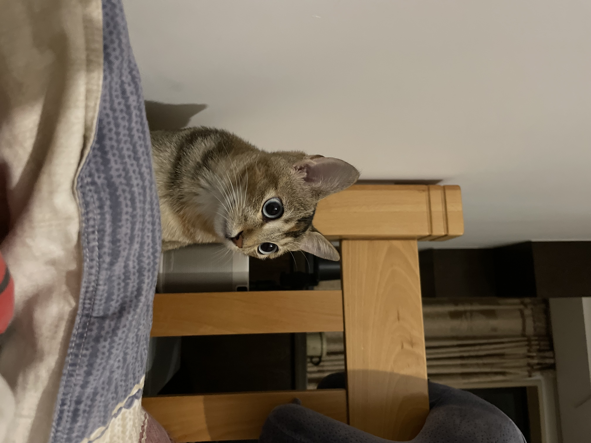

# InstructBLIP

## Prepare COCO Caption

- Ref to [Datasets-MS_COCO](https://github.com/X1AOX1A/Datasets/tree/main/MS_COCO)

## Prepare Vicuna Weights

- Ref to [Demos-Vicuna](https://github.com/X1AOX1A/Demos/tree/main/Vicuna)

## Image Caption Inference

```shell
cd infer
python image_caption.py # prompt: "Write a detailed description."
```
<p align="center">
 
</p>

- output:

    `["The image depicts a small cat sitting underneath a wooden bed frame, peeking out from behind it. The cat appears to be curious and interested in what's happening around it. There are two other cats in the scene, one on the left side of the image and the other on the right side. Both cats seem to be relaxing and enjoying their surroundings. In addition to the cats, there is a person visible in the background, possibly taking care of them or interacting with them."]`
    
## COCO Test Samples

<details></summary>COCO Test Samples</summary>

```shell
{"image": "val2014/COCO_val2014_000000391895.jpg", 
 "caption": ["A man with a red helmet on a small moped on a dirt road. ", 
            "Man riding a motor bike on a dirt road on the countryside.", 
            "A man riding on the back of a motorcycle.", 
            "A dirt path with a young person on a motor bike rests to the foreground of a verdant area with a bridge and a background of cloud-wreathed mountains. ", 
            "A man in a red shirt and a red hat is on a motorcycle on a hill side."]}, 
{"image": "val2014/COCO_val2014_000000060623.jpg", 
 "caption": ["A young girl inhales with the intent of blowing out a candle. ", 
            "A young girl is preparing to blow out her candle.", 
            "A kid is to blow out the single candle in a bowl of birthday goodness. ", 
            "Girl blowing out the candle on an ice-cream ", 
            "A little girl is getting ready to blow out a candle on a small dessert."]}, 
{"image": "val2014/COCO_val2014_000000483108.jpg", 
 "caption": ["A man on a bicycle riding next to a train", 
            "A person is riding a bicycle but there is a train in the background.", 
            "a red and white train and a man riding a bicycle", 
            "a guy that is riding his bike next to a train", 
            "A man riding a bike past a train traveling along tracks."]}, 
{"image": "val2014/COCO_val2014_000000384213.jpg",
 "caption": ["A kitchen is shown with a variety of items on the counters.", 
            "A kitchen has the windows open and plaid curtains.", 
            "A kitchen with two windows and two metal sinks.", 
            "An older kitchen with cluttered counter tops but empty sink.", 
            "Glasses and bottles are placed near a kitchen sink."]}, 
{"image": "val2014/COCO_val2014_000000386164.jpg",
 "caption": ["A wooden ball on top of a wooden stick.", 
            "The table is full of wooden spoons and utensils.", 
            "A wood table holding an assortment of wood cooking utensils.", 
            "A selection of wooden kitchen tools on a counter.", 
            "Wooden spoons are lined up on a table"]}, 
{"image": "val2014/COCO_val2014_000000223648.jpg",
 "caption": ["Multiple wooden spoons are shown on a table top.", 
            "A table surrounded by chairs and filled with cooking utensils.", 
            "Wooden spoons laid out across a kitchen table.", 
            "Wooden spoons and forks are all over a table.", 
            "A table and chairs with wooden kitchen tools on top."]}
```
</details>

## Zero-shot on COCO Caption


```shell
bash eval/eval_caption_coco_zeroshot.sh
```

- results (id: [20230530193](../output/BLIP2_Instruct/Caption_coco/20230530193)):

    ```shell
    {"test": {"Bleu_1": 0.7466045230315724, "Bleu_2": 0.5993208337263296, "Bleu_3": 0.4675615004127482, "Bleu_4": 0.3585509550197416, "METEOR": 0.3212760433534643, "ROUGE_L": 0.585138477095227, "CIDEr": 1.2763550147656038, "SPICE": 0.2630221747601865}}
    ```

- output examples (test_epochbest.json):

    ```shell
    {"caption": "a man riding a motorcycle on a dirt road with mountains in the background", "image_id": 391895}, 
    {"caption": "a bunch of wooden spoons and forks laying on top of a table", "image_id": 386164}, 
    {"caption": "a group of people riding bikes down a bike lane on a city street", "image_id": 462565}, 
    {"caption": "a black and white photo of a man riding a motorcycle on the road", "image_id": 559665}, 
    {"caption": "there are many bunches of bananas sitting in a wooden crate", "image_id": 579664}, 
    {"caption": "a small blue and white airplane sitting on top of a grassy field", "image_id": 561100}, 
    ```

## Fine-tune on COCO Caption

```shell
bash train/train_caption_coco.sh
```

- It may take 5 hours on 4 40GB A100 GPUs (with frozen VIT).

### 1. Config1

```shell
model:
  arch: blip2_vicuna_instruct
  model_type: vicuna7b        
  load_finetuned: False

  # vit encoder
  # InstructBLIP maintains the same image resolution (224×224) during instruction
  # tuning and keeps the visual encoder frozen during finetuning.
  image_size: 224               # follow paper setting for VQA fine-tuning
  use_grad_checkpoint: True
  vit_precision: "fp16"         # follow blip2_instruct_vicuna7b.yaml (pre-train)
  freeze_vit: True

datasets:
  coco_caption_extend: # name of the dataset builder
    vis_processor:
        train:
          name: "blip2_image_train"
          image_size: 224       # follow paper setting for VQA fine-tuning
        eval:
          name: "blip_image_eval"
          image_size: 224       # follow paper setting for VQA fine-tuning
    text_processor:
        train:
          name: "blip_caption"
          prompt: "a photo of " # follow blip2_caption_coco_ft.yaml (fine-tune)
        eval:
          name: "blip_caption"
```

- results (id: [20230530073](../output/BLIP2_Instruct/Caption_coco/20230530073)):

    ```shell
    {"val": {"Bleu_1": 0.647760605064115, "Bleu_2": 0.5081890057061402, "Bleu_3": 0.3870170587289628, "Bleu_4": 0.2912790733097921, "METEOR": 0.3105995652934542, "ROUGE_L": 0.5343182267923948, "CIDEr": 0.9134107450064268, "SPICE": 0.24478299750963978}}
    {"val": {"Bleu_1": 0.5973055018941694, "Bleu_2": 0.46719563440119, "Bleu_3": 0.35508273509355626, "Bleu_4": 0.26709520067779924, "METEOR": 0.3025066755240536, "ROUGE_L": 0.5138951656222592, "CIDEr": 0.7688301034126004, "SPICE": 0.23116755154918991}}
    {"val": {"Bleu_1": 0.5770818611224684, "Bleu_2": 0.4514493446288603, "Bleu_3": 0.3441983234504983, "Bleu_4": 0.2605700851723652, "METEOR": 0.3009256915964947, "ROUGE_L": 0.5065751216446777, "CIDEr": 0.7280729940998132, "SPICE": 0.22763485904351846}}
    {"val": {"Bleu_1": 0.5771319500030715, "Bleu_2": 0.45014913368789566, "Bleu_3": 0.34284573914070754, "Bleu_4": 0.25943214491020883, "METEOR": 0.30091932290952034, "ROUGE_L": 0.5060713644392506, "CIDEr": 0.715442978792575, "SPICE": 0.22842278087565324}}
    {"val": {"Bleu_1": 0.5768921741925045, "Bleu_2": 0.44874855467959657, "Bleu_3": 0.3416551869039863, "Bleu_4": 0.258942834298103, "METEOR": 0.30060672479425654, "ROUGE_L": 0.5055461980659608, "CIDEr": 0.7206900767766667, "SPICE": 0.22744325720067235}}
    {"test": {"Bleu_1": 0.6456479384971744, "Bleu_2": 0.5052420130194599, "Bleu_3": 0.3843327099490886, "Bleu_4": 0.2888257389065465, "METEOR": 0.31081583936668, "ROUGE_L": 0.5325931803724581, "CIDEr": 0.9149957264609108, "SPICE": 0.2477929364222591}}
    ```
- output examples (test_epochbest.json):

    ```shell
    {"caption": "a photo of a man riding a motorcycle down a dirt road with a mountain in the background", "image_id": 391895}, 
    {"caption": "a collection of wooden spoons, forks, and other kitchen utensils are lined up on a table", "image_id": 386164}, 
    {"caption": "a group of people riding bicycles down a bike lane on a city street", "image_id": 462565}, 
    {"caption": "a black and white photograph of a man riding a motorcycle on the road", "image_id": 559665}, 
    {"caption": "a photo of bananas are piled high in a wooden crate at an outdoor market", "image_id": 579664}, 
    {"caption": "a close up of a small blue and white airplane sitting on top of a grassy field", "image_id": 561100},
    ```

### 2. Config2

```shell
model:
  arch: blip2_vicuna_instruct
  model_type: vicuna7b        
  load_finetuned: False

  # vit encoder
  # InstructBLIP maintains the same image resolution (224×224) during instruction
  # tuning and keeps the visual encoder frozen during finetuning.
  image_size: 224               # follow paper setting for VQA fine-tuning
  use_grad_checkpoint: True
  vit_precision: "fp16"         # follow blip2_instruct_vicuna7b.yaml (pre-train)
  freeze_vit: True

datasets:
  coco_caption_extend: # name of the dataset builder
    vis_processor:
        train:
          name: "blip2_image_train"
          image_size: 224       # follow paper setting for VQA fine-tuning
        eval:
          name: "blip_image_eval"
          image_size: 224       # follow paper setting for VQA fine-tuning
    text_processor:
        train:
          name: "blip_caption"
          # prompt: "a photo of " # remove prompt
        eval:
          name: "blip_caption"
```
- results (id: [20230530140](../output/BLIP2_Instruct/Caption_coco/20230530140)):

    ```shell
    {"val": {"Bleu_1": 0.7220016618963974, "Bleu_2": 0.5704259859815827, "Bleu_3": 0.438630491578156, "Bleu_4": 0.3326873871582765, "METEOR": 0.31416461167510695, "ROUGE_L": 0.5639709605355904, "CIDEr": 1.1862728592930292, "SPICE": 0.25501800646269157}}
    {"val": {"Bleu_1": 0.7270454898307603, "Bleu_2": 0.5730622702537845, "Bleu_3": 0.44045212811716666, "Bleu_4": 0.33428713049895437, "METEOR": 0.3150557488214792, "ROUGE_L": 0.5637670404562377, "CIDEr": 1.201592559395042, "SPICE": 0.2533526675385253}}
    {"val": {"Bleu_1": 0.726243748354819, "Bleu_2": 0.5731382656596921, "Bleu_3": 0.4418103304017568, "Bleu_4": 0.3358400135261264, "METEOR": 0.31564573729292555, "ROUGE_L": 0.5656436362650309, "CIDEr": 1.1995867636091258, "SPICE": 0.2538992603065989}}
    {"val": {"Bleu_1": 0.7236866274797832, "Bleu_2": 0.5682576240663273, "Bleu_3": 0.43608354049670417, "Bleu_4": 0.330147998997028, "METEOR": 0.315157839288927, "ROUGE_L": 0.5611568564811082, "CIDEr": 1.1822040887867935, "SPICE": 0.25527573987893337}}
    {"val": {"Bleu_1": 0.7245432418276377, "Bleu_2": 0.5696958708425305, "Bleu_3": 0.437173109509744, "Bleu_4": 0.3304573870433346, "METEOR": 0.3150635077852909, "ROUGE_L": 0.5619112083021703, "CIDEr": 1.1851816063875293, "SPICE": 0.2541352018823883}}
    {"test": {"Bleu_1": 0.7278631469367983, "Bleu_2": 0.5763612766028686, "Bleu_3": 0.44552994783644373, "Bleu_4": 0.3394997649602075, "METEOR": 0.31657784749619083, "ROUGE_L": 0.5672990346704339, "CIDEr": 1.222601238307893, "SPICE": 0.25930430961814355}}
    ```

- output examples (test_epochbest.json):

    ```shell
    {"caption": "a man riding a motorcycle on a dirt road with a mountain in the background", "image_id": 391895}, 
    {"caption": "there are many wooden spoons and forks lined up on a table", "image_id": 386164}, 
    {"caption": "a group of people riding bicycles down a bike lane on a city street", "image_id": 462565}, 
    {"caption": "a black and white photo of a man riding a motorcycle with luggage on the back", "image_id": 559665}, 
    {"caption": "there are many bunches of ripe and unripe bananas in a wooden crate", "image_id": 579664}, 
    {"caption": "a close up of a toy airplane sitting on the ground in a field", "image_id": 561100}, 
    ```

### 3. Config3

```shell
model:
  arch: blip2_vicuna_instruct
  model_type: vicuna7b        
  load_finetuned: False

  # vit encoder
  image_size: 364           # 224 -> 364, same as BLIP2-OPT
  use_grad_checkpoint: True
  vit_precision: "fp32"     # fp16 -> fp32, same as BLIP2-OPT
  freeze_vit: True

datasets:
  coco_caption_extend: # name of the dataset builder
    vis_processor:
        train:
          name: "blip2_image_train"
          image_size: 364   # 224 -> 364, same as BLIP2-OPT
        eval:
          name: "blip_image_eval"
          image_size: 364   # 224 -> 364, same as BLIP2-OPT
    text_processor:
        train:
          name: "blip_caption"
        eval:
          name: "blip_caption"
```

- results (id: [20230530200](../output/BLIP2_Instruct/Caption_coco/20230530200)):

    ```shell
    {"val": {"Bleu_1": 0.7223830494903033, "Bleu_2": 0.5720198155590948, "Bleu_3": 0.44170136149752964, "Bleu_4": 0.33694593501369136, "METEOR": 0.3162939284380281, "ROUGE_L": 0.5659274864399679, "CIDEr": 1.198395668199758, "SPICE": 0.25558297279377773}}
    {"val": {"Bleu_1": 0.730013839861901, "Bleu_2": 0.5758633306113864, "Bleu_3": 0.4425502726641666, "Bleu_4": 0.3362122103663983, "METEOR": 0.3161968206972472, "ROUGE_L": 0.5668404176018996, "CIDEr": 1.2083830196966556, "SPICE": 0.2549904385956513}}
    {"val": {"Bleu_1": 0.7275446793418648, "Bleu_2": 0.572917509595055, "Bleu_3": 0.44066838394794755, "Bleu_4": 0.33476024359615136, "METEOR": 0.31604669328356016, "ROUGE_L": 0.5660869674451197, "CIDEr": 1.1922701648005396, "SPICE": 0.25569855507940165}}
    {"val": {"Bleu_1": 0.7265992132131102, "Bleu_2": 0.5723489189212765, "Bleu_3": 0.44021778542656953, "Bleu_4": 0.33460363739063154, "METEOR": 0.3175027025602582, "ROUGE_L": 0.5650015422535982, "CIDEr": 1.1920597183199857, "SPICE": 0.25644834313716064}}
    {"val": {"Bleu_1": 0.7277065406462029, "Bleu_2": 0.5721808107230061, "Bleu_3": 0.43952925798761777, "Bleu_4": 0.3330760040063023, "METEOR": 0.31586378580876445, "ROUGE_L": 0.5635771258751316, "CIDEr": 1.1880406736012215, "SPICE": 0.25612229387122326}}
    {"test": {"Bleu_1": 0.7287232389770885, "Bleu_2": 0.5769753488637221, "Bleu_3": 0.4461610385180321, "Bleu_4": 0.33984031098849005, "METEOR": 0.317469198885754, "ROUGE_L": 0.5691194868337418, "CIDEr": 1.2194068333038235, "SPICE": 0.25962940599291295}}
    ```

- output examples (test_epochbest.json):

    ```shell
    {"caption": "a man riding a motorcycle on a dirt road with a mountain in the background", "image_id": 391895}, 
    {"caption": "there are many wooden spoons and forks lined up on a table", "image_id": 386164}, 
    {"caption": "a group of people riding bicycles down a bike lane on a city street", "image_id": 462565}, 
    {"caption": "a black and white photo of two men riding on a motorcycle", "image_id": 559665}, 
    {"caption": "there are many bunches of ripe and unripe bananas in a bin", "image_id": 579664}, 
    {"caption": "a close up of a model airplane sitting on the ground in a field", "image_id": 561100}, 
    ```

### 4. Config4

```shell
model:
  arch: blip2_vicuna_instruct
  model_type: vicuna7b        
  load_finetuned: False

  # vit encoder
  image_size: 364           # 224 -> 364, same as BLIP2-OPT
  use_grad_checkpoint: True
  vit_precision: "fp32"     # fp16 -> fp32, same as BLIP2-OPT
  freeze_vit: False         # True -> False, same as BLIP2-OPT

datasets:
  coco_caption_extend: # name of the dataset builder
    vis_processor:
        train:
          name: "blip2_image_train"
          image_size: 364   # 224 -> 364, same as BLIP2-OPT
        eval:
          name: "blip_image_eval"
          image_size: 364   # 224 -> 364, same as BLIP2-OPT
    text_processor:
        train:
          name: "blip_caption"
        eval:
          name: "blip_caption"
```

- results (id: ):

    ```shell
    OOM
    ```

- output examples (test_epochbest.json):

    ```shell
    ```