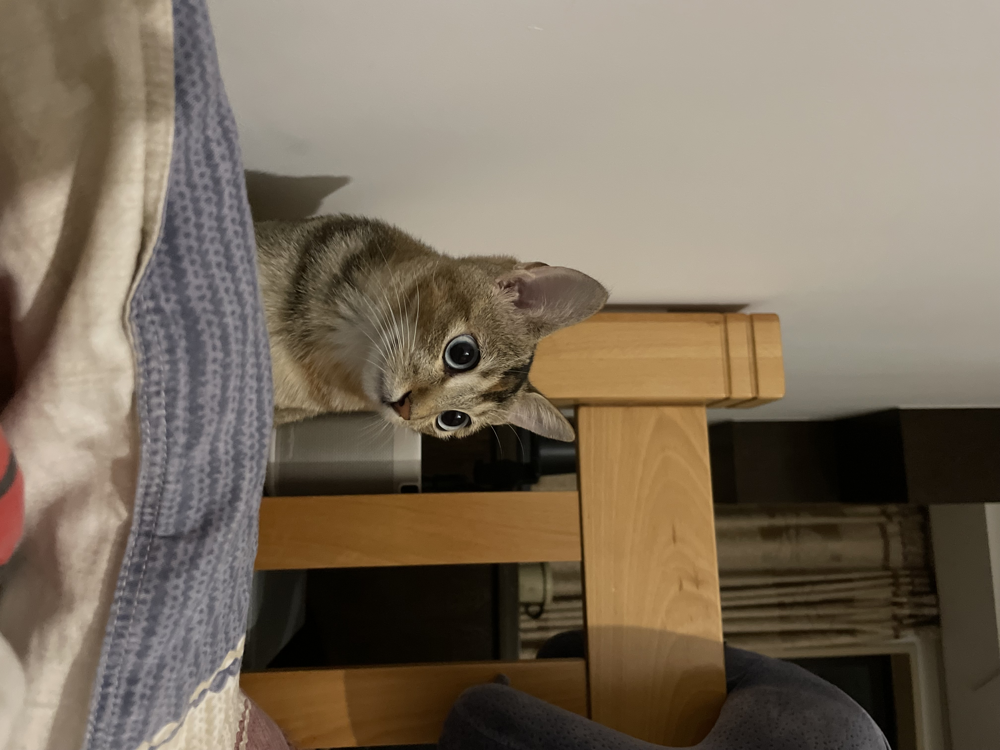

# MiniGPT-4

## Preparation

### Prepare COCO Caption

- Ref to [Datasets-MS_COCO](https://github.com/X1AOX1A/Datasets/tree/main/MS_COCO)

<details></summary>COCO Test Samples</summary>

```shell
{"image": "val2014/COCO_val2014_000000391895.jpg", 
"caption": ["A man with a red helmet on a small moped on a dirt road. ", 
            "Man riding a motor bike on a dirt road on the countryside.", 
            "A man riding on the back of a motorcycle.", 
            "A dirt path with a young person on a motor bike rests to the foreground of a verdant area with a bridge and a background of cloud-wreathed mountains. ", 
            "A man in a red shirt and a red hat is on a motorcycle on a hill side."]}, 
{"image": "val2014/COCO_val2014_000000060623.jpg", 
"caption": ["A young girl inhales with the intent of blowing out a candle. ", 
            "A young girl is preparing to blow out her candle.", 
            "A kid is to blow out the single candle in a bowl of birthday goodness. ", 
            "Girl blowing out the candle on an ice-cream ", 
            "A little girl is getting ready to blow out a candle on a small dessert."]}, 
{"image": "val2014/COCO_val2014_000000483108.jpg", 
"caption": ["A man on a bicycle riding next to a train", 
            "A person is riding a bicycle but there is a train in the background.", 
            "a red and white train and a man riding a bicycle", 
            "a guy that is riding his bike next to a train", 
            "A man riding a bike past a train traveling along tracks."]}, 
{"image": "val2014/COCO_val2014_000000384213.jpg",
"caption": ["A kitchen is shown with a variety of items on the counters.", 
            "A kitchen has the windows open and plaid curtains.", 
            "A kitchen with two windows and two metal sinks.", 
            "An older kitchen with cluttered counter tops but empty sink.", 
            "Glasses and bottles are placed near a kitchen sink."]}, 
{"image": "val2014/COCO_val2014_000000386164.jpg",
"caption": ["A wooden ball on top of a wooden stick.", 
            "The table is full of wooden spoons and utensils.", 
            "A wood table holding an assortment of wood cooking utensils.", 
            "A selection of wooden kitchen tools on a counter.", 
            "Wooden spoons are lined up on a table"]}, 
{"image": "val2014/COCO_val2014_000000223648.jpg",
"caption": ["Multiple wooden spoons are shown on a table top.", 
            "A table surrounded by chairs and filled with cooking utensils.", 
            "Wooden spoons laid out across a kitchen table.", 
            "Wooden spoons and forks are all over a table.", 
            "A table and chairs with wooden kitchen tools on top."]}
```
</details>

### Prepare Vicuna Weights

- Ref to [Demos-Vicuna](https://github.com/X1AOX1A/Demos/tree/main/Vicuna)

### Prepare MiniGPT-4 Weights

- Ref to [Demos-MiniGPT-4](https://github.com/X1AOX1A/Demos/blob/main/MiniGPT-4/X1A/download_minigpt4.md)

## 0. Image Caption Prompts

- Ref to (image_caption.txt)[./prompts/image_caption.txt]

```
<ImageHere></Img> Give a short image caption.
<ImageHere></Img> Give a short image description.
<ImageHere></Img> Write a short description for the image.
<ImageHere></Img> Write a description for the photo.
<ImageHere></Img> Provide a description of what is presented in the photo. 
<ImageHere></Img> Briefly describe the content of the image.
<ImageHere></Img> Can you briefly explain what you see in the image?
<ImageHere></Img> Could you use a few words to describe what you perceive in the photo? 
<ImageHere></Img> Please provide a short depiction of the picture.
<ImageHere></Img> Using language, provide a short account of the image.
<ImageHere></Img> Use a few words to illustrate what is happening in the picture.
```

## 1. Image Caption Inference

```shell
cd infer
python image_caption.py
```
<p align="center">
 
</p>

- output:

    `"The image shows a small cat sitting on a bed, looking up at the camera with big, curious eyes. The cat's fur is a mix of light and dark brown, and it has white paws and a white patch on its chest. The cat's eyes are a bright blue color, and its whiskers are long and bushy. The cat appears to be healthy and well-fed, with a shiny coat and bright eyes. The background of the image is a wooden bed frame with a blanket and pillow on it. The wall behind the bed is made of plaster and has a few cracks in it. There is a window behind the cat, but it is not visible in the image. The overall impression of the image is one of warmth and comfort, with the cat looking cozy and content on the bed."`

## 2. Zero-shot on COCO Caption

### 7B

```shell
bash X1A/eval/caption_coco_zeroshot_vicuna7b.sh
```

- results (id: [20230604141](./output/Caption_coco/zeroshot/20230604141)):

    ```shell
    {"test": {"Bleu_1": 0.4820870380661253, "Bleu_2": 0.3401892255319211, "Bleu_3": 0.23565363787189772, "Bleu_4": 0.1626809696901491, "METEOR": 0.2717151073190081, "ROUGE_L": 0.40910759242588157, "CIDEr": 0.12561348374309772, "SPICE": 0.22056907444717466}}
    ```

- output examples (test_epochbest.json):

    ```shell
    {"caption": "The image shows a man riding a motorcycle down a dirt road. The man is wearing a red shirt and black helmet", "image_id": 391895}, 
    {"caption": "The image shows a man riding a bicycle on a dirt road next to a train track. The train is passing by in the", "image_id": 483108}, 
    {"caption": "The image shows a wooden table with various spoons and forks arranged on it. The spoons and forks are made of wood and are", "image_id": 386164}, 
    {"caption": "A white bathroom with a toilet, sink, and shower. The walls are tiled and there is a fan hanging from", "image_id": 403385}, 
    {"caption": "This image shows a group of people riding bicycles on a bike lane in a city. The lane is painted green and", "image_id": 462565},
    {"caption": "This image shows a bathroom with a toilet, sink, and a wooden shelf holding various items such as toothbrushes", "image_id": 192440}, 
    ```

### 13B

```shell
bash X1A/eval/caption_coco_zeroshot_vicuna13b.sh
```

- results (id: [20230604143](./output/Caption_coco/zeroshot/20230604143)):

    ```shell
    {"test": {"Bleu_1": 0.4861511006448363, "Bleu_2": 0.34079105130859116, "Bleu_3": 0.23551985689380542, "Bleu_4": 0.16136267645740487, "METEOR": 0.26675690771735394, "ROUGE_L": 0.40052710178184003, "CIDEr": 0.15520855369832945, "SPICE": 0.21353488688868716}}
    ```

- output examples (test_epochbest.json):

    ```shell
    {"caption": "The image shows a man riding a motorcycle on a dirt road with mountains in the background. The man is wearing a red sh", "image_id": 391895}, 
    {"caption": "The image shows a man riding a bicycle on a dirt road next to a train track. The train is in the distance,", "image_id": 483108}, 
    {"caption": "This image shows a table with a variety of wooden utensils, including spoons, forks, and knives, arranged neatly on", "image_id": 386164}, 
    {"caption": "A white bathroom with a toilet, sink, and shower. The shower has a white plastic shower curtain and", "image_id": 403385}, 
    {"caption": "This image shows a group of people riding bicycles on a city street. There are cars parked on the side of the road and", "image_id": 462565}, 
    {"caption": "This is a photo of a bathroom with a toilet, sink, and shelving unit. The shelving unit is made", "image_id": 192440}, 
    ```

## 3. Fine-tune on COCO Caption

### 7B


```shell
bash X1A/train/caption_coco_ft_vicuna7b.sh
```

- It may take 17.5 hours on 1 40GB A100 GPU.

- results (id: [20230604165](./output/Caption_coco/finetune/20230604165)):

    ```shell
    {"val": {"Bleu_1": 0.8285643580412961, "Bleu_2": 0.6820938076419607, "Bleu_3": 0.5404658783743302, "Bleu_4": 0.4204802614017213, "METEOR": 0.3032221362167212, "ROUGE_L": 0.6054528940955787, "CIDEr": 1.3708131604524039, "SPICE": 0.23619780610507632}}
    {"val": {"Bleu_1": 0.8251942053327562, "Bleu_2": 0.6771352902537126, "Bleu_3": 0.5345543738366186, "Bleu_4": 0.4143061039058681, "METEOR": 0.3059235420316675, "ROUGE_L": 0.604510012355409, "CIDEr": 1.3724396103351058, "SPICE": 0.23888237931971804}}
    {"val": {"Bleu_1": 0.8265086661324837, "Bleu_2": 0.6796314050954964, "Bleu_3": 0.5393680585907877, "Bleu_4": 0.422310112893888, "METEOR": 0.3077307999149136, "ROUGE_L": 0.60621960800547, "CIDEr": 1.3891688638164694, "SPICE": 0.2402761887811588}}
    {"val": {"Bleu_1": 0.8280383364855213, "Bleu_2": 0.681159806659122, "Bleu_3": 0.5405530740670027, "Bleu_4": 0.4230513432290564, "METEOR": 0.3077385733109276, "ROUGE_L": 0.6076068112942264, "CIDEr": 1.3912009747045921, "SPICE": 0.23992969383556284}}
    {"val": {"Bleu_1": 0.8296055871646845, "Bleu_2": 0.6831360759957191, "Bleu_3": 0.54305927878861, "Bleu_4": 0.4251564097863464, "METEOR": 0.30782148031350504, "ROUGE_L": 0.6082624233604935, "CIDEr": 1.3882465566609037, "SPICE": 0.23911777628752753}}
    {"test": {"Bleu_1": 0.8235381576431932, "Bleu_2": 0.6763404423956201, "Bleu_3": 0.5374860161883245, "Bleu_4": 0.41988559758412775, "METEOR": 0.30698082113681496, "ROUGE_L": 0.6066327840239495, "CIDEr": 1.3921050590438404, "SPICE": 0.24105304769371916}}
    ```

- output examples (test_epochbest.json):

    ```shell
    {"caption": "a man riding a motorcycle down a dirt road", "image_id": 391895}, 
    {"caption": "a young girl blowing out candles on a cake", "image_id": 60623}, 
    {"caption": "a man riding a bicycle next to a train", "image_id": 483108}, 
    {"caption": "a kitchen with a sink and a window", "image_id": 384213}, 
    {"caption": "a bunch of wooden spoons and forks on a table", "image_id": 386164}, 
    {"caption": "a table with many wooden spoons on it", "image_id": 223648}, 
    ```

### 13B

```shell
bash X1A/train/caption_coco_ft_vicuna13b.sh
```

- It may take 32.5 hours on 1 40GB A100 GPU.

- results (id: [20230604175](./output/Caption_coco/finetune/20230604175)):

    ```shell
    ```

- output examples (test_epochbest.json):

    ```shell
    ```